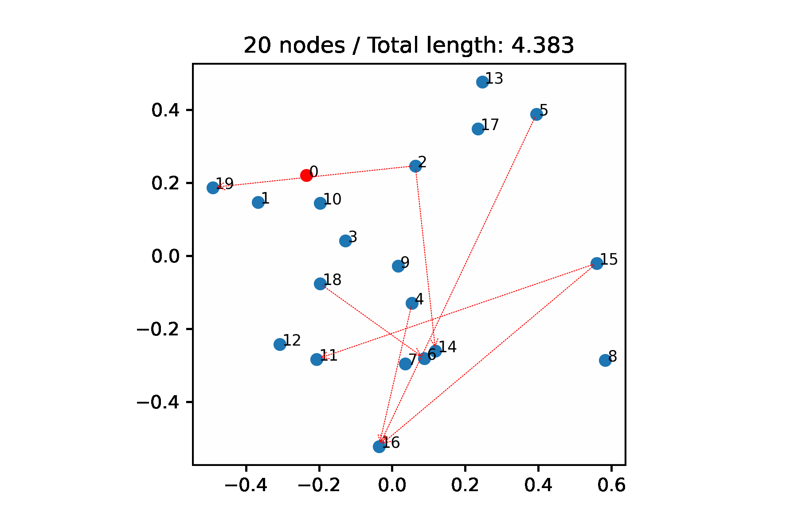

# Solving the Traveling Salesperson Problem with Precedence Constraints by Deep Reinforcement Learning
The original code to Christian Löwens, Muhammad Inaam Ashraf, Alexander Gembus, Genesis Cuizon, Jonas K. Falkner, Lars Schmidt-Thieme **"Solving the Traveling Salesperson Problem with Precedence Constraints by Deep Reinforcement Learning"**.

The paper is accepted for publication at 45th German Conference on Artificial Intelligence (KI-2022). The preprint can be found [here](https://arxiv.org/abs/2207.01443).
<p align="center">

</p>
## Requirements
Tested with:
- conda
    - python=3.9.12
    - pytorch=1.12.0
    - numpy=1.22.3
    - scipy=1.7.3
    - tqdm=4.64.0
    - matplotlib=3.5.1 (only necessary for plots)
- pip:
    - tsplib95=0.7.1 (only necessary for LKH-3 solver)

## Minimal working example
Have a look at `mwe.ipynb` to get the basic model running.

## Training
```python
from utils import trainer
trainer.train(n_nodes=20, baseline="rollout")
```
Other optional arguments:
```python
pred2succ:bool=True  # add attentions from predecessors to successors (ps)
succ2pred:bool=True  # add attentions from successors to predecessors (sp)
pred_group:bool=True # add attentions to all other members of the same constraint group (mm)

sparse_thresh:float=math.inf    # distance threshold d_t to sparisfy attentions
warm_load_path:str=None         # path to pretrained model

n_epochs:int=100                # number of epochs
epoch_size:int=100000           # generated instances per epoch
batch_size:int=200              # training batch size
val_size:int=10000              # total validation size
eval_batch_size:int=100         # validation batch size

run_name:str=None               # model name
progress_bar=True               # enable/disable progress_bar
```

The default number of random precedence contraints for training is `0.33*n_nodes`. The trained model is saved in the folder `outputs`. 

## Inference
```python
from utils import solver, problem_generator as probgen
tsppc20 = probgen.generate_tsppc_matrix(n_nodes=20)
solver.solve_single(tsppc20, model_file_path=model_file_path)
```
Other optional arguments:
```python
n_samples:int=None      # Sampling size, if None => greedy
beam_search:bool=False  # use beam search
normalize:bool=True     # input normalized before passed into the model
```

To solve a list of TSPPCs at once use `solver.solve_multiple`.


## Copyright
The folder `src` is a fork of [Demon0312/Heterogeneous-Attentions-PDP-DRL](https://github.com/Demon0312/Heterogeneous-Attentions-PDP-DRL) with substantial changes. Check out the `/src/LICENSE` file for more details.
